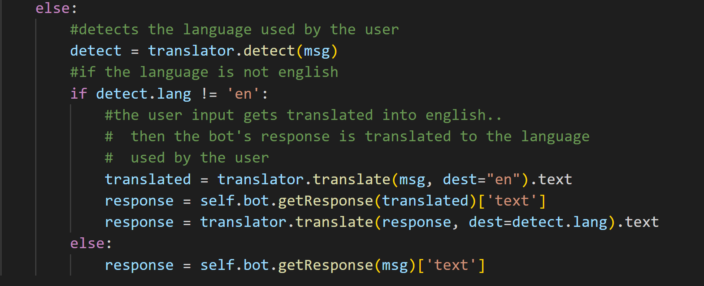
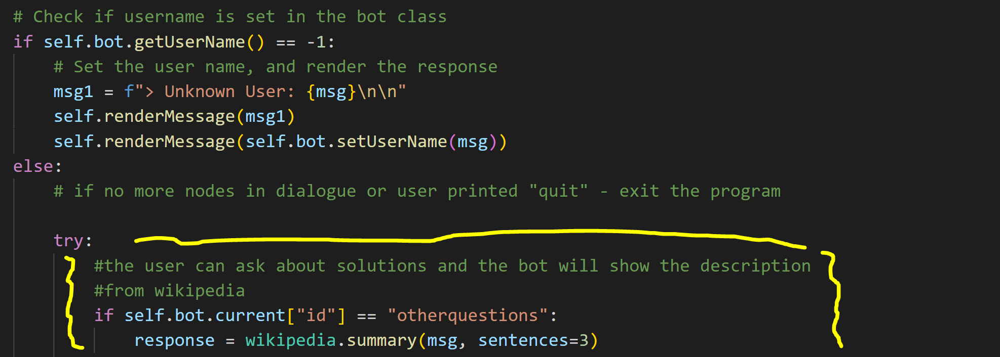

# Individual Psych Bot - Vinu Ihalagamage 

## [!!! Click for Repository !!!](https://github.com/vinui409/Individual-Psych-Bot-.git)
## [!!! Click for Project Setup !!!](ProjectSetup.md)

##  List of APIs - Individual Project

 ### 1) Google Translate 
   - Google translate is used so that the user can speak to the bot in any preffered language.
   - The bot will detect the user's language, translate and reply to the user in the language used by the user.

 ### 2) Wikipedia
   - As the psych-bot offeres psychologica advice, the user is able to ask about any medicine or other methods to help their situation
   - The bot will show the description from wikipedia. 

## Presentation
https://drive.google.com/file/d/1nEcofT4YLiiue-Ddux8V7BnnlcjXn-Gp/view?usp=sharing

### Assignment 2 and 3

[CLICK HERE for the README of AS 1 and AS 2](Group.README.md)

